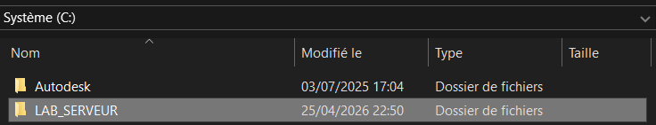
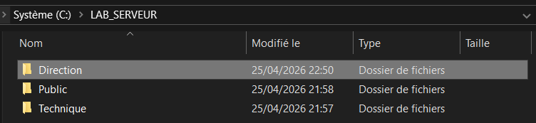
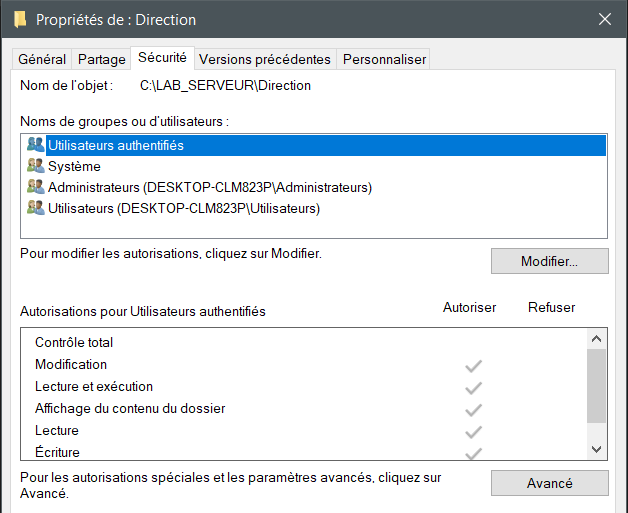
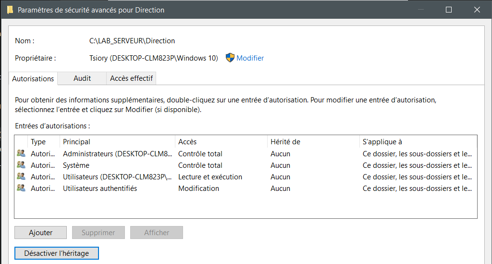
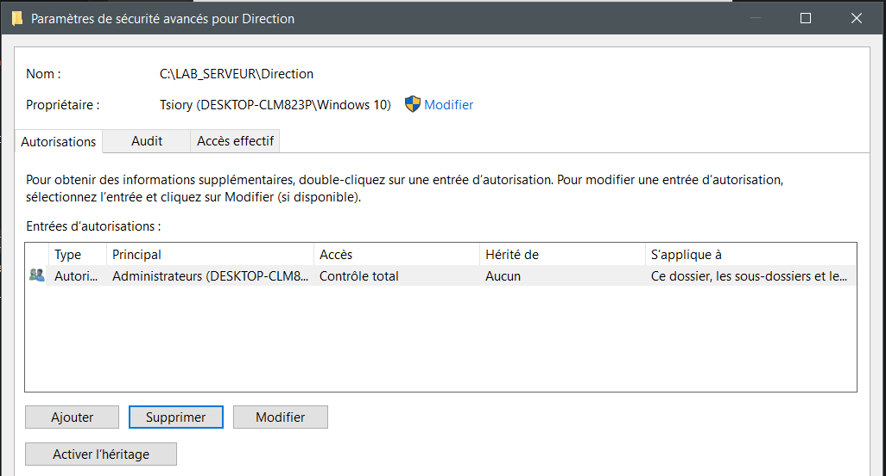
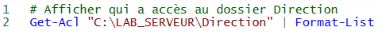
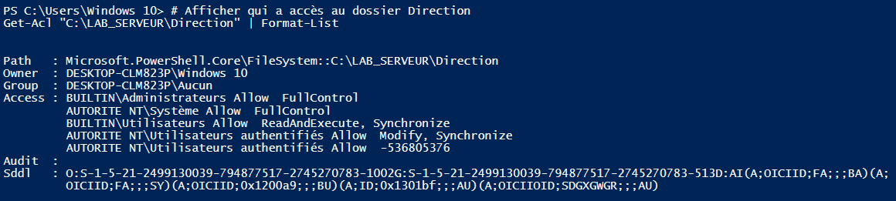

### I. Création de l'arborescence
    Création du dossier : LAB_SERVER  
    
    LAB_SERVER/Directeur
    
### II. Désactivation de l'héritage
    
    
    
### III. Configuration des ACL
    
    

